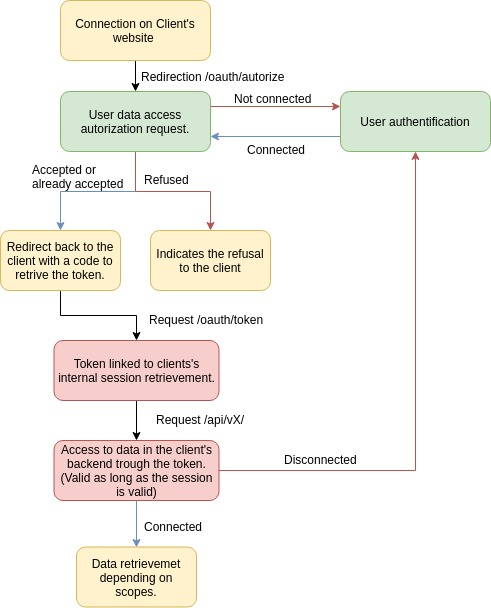

# Authentification

L'API du Portail utilise [OAuth 2.0](https://oauth.net/2/), un puissant framework d'autorisation.

## Clés user et clés client

Pour authentifier votre client auprès de l'API, vous devez possèder une clé _client_ et/ou une clé user.
- Les clés _user_ sont liée à votre compte. Ce sont des tokens d'accès personel, ayant donc une portée limitée à vos droits et vos données.
- Les clés _client_ correspondent à des associations. Elles ont des portée en général plus large que les clés _user_

## Spécifier ses tokens dans une requête

### Sous Insomnia ou Postman

- Type : OAuth2.0
- Grant type : Authorization Code
- Authorization url: https://assos.utc.fr/oauth/authorize
- Access token url : https://assos.utc.fr/oauth/token
- Client ID : l'ID de votre asso/client
- Client secret : la clé de votre asso/client
- Redirect url : l'adresse de votre application pour récupérer le code du token

### Par du code

Des packages sont disponibles pour utiliser OAuth2 facilement selon le langage utilisé :

- Javascript : https://github.com/lelylan/simple-oauth2
- Python : https://github.com/oauthlib/oauthlib
- PHP : https://github.com/thephpleague/oauth2-client

## Schéma

