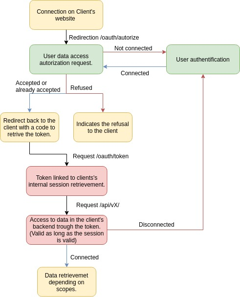

# OAuth2 connection

## Table of content
- [OAuth2 connection](#oauth2-connection)
  - [Table of content](#table-of-content)
  - [Introduction](#introduction)
  - [Protocol](#protocol)
  - [Usage](#usage)
    - [Under Insomnia or Postman](#under-insomnia-or-postman)
    - [With code](#with-code)
      - [Example with NodeJS with the oauth package](#example-with-nodejs-with-the-oauth-package)


## Introduction

L'API du Portail utilise [OAuth 2.0](https://oauth.net/2/), un puissant framework d'autorisation.

Pour authentifier votre Client auprès de l'API, vous devez possèder une clé _client_ et/ou une clé _user_.
- Les clés _user_ sont liée à votre compte. Ce sont des tokens d'accès personel, ayant donc une portée limitée à vos droits et vos données.
- Les clés _client_ correspondent principalement à des associations. Elles ont des portée en général plus large que les clés _user_

**Ces clés doivent être gardées secrètes.**

Il existe 4 rôles :

- Resource Owner (l'utilisateur "lambda")
- Client (c'est vous)
- Resource Server & Authorization Server (c'est nous)

On peut utiliser OAuth2 sur le portail des assos de deux manières différentes, distinguées par deux *grant types* différents :

- Authorization Code
- Client Credentials

Le second type est uniquement sur autorisation du SiMDE. Nous nous concentrerons sur le premier.

Dans le cas du Authorization Code, l'utilisateur va autoriser le client (votre application) à accèder à *certaines données* qui sont stockées sur notre serveur. Vous choisissez les données auxquelles vous voulez accèder par des *scopes* et l'utilisateur est libre d'accepter ou non.

*Typiquement, ce genre d'autorisation se fait chez Google et Facebook, lorsque vous vous connectez à des applications tierces, vous vous trouvez devant une page d'autorisation pour certaines de vos données.*

Pour en savoir plus : [documentation/backend/](../backend/readme.md).


## Protocol

Pour résumer OAuth2 dans l'action, il y a trois étapes :

- Redirection vers le serveur d'authentification https://assos.utc.fr/oauth/authorize avec les paramètres suivants :
    - `client_id` : ID du client
    - `client_secret` : Secret du client
    - `response_type` : code
    - `redirect_uri` : [adresse de redirection spécifiée à la création du client]
    - `scopes[]` : tableau des scopes demandés (ex : 'user-manage-groups')
    - `state` : '' (A DÉFINIR)
- L'utilisateur accepte, redirection vers le callback client avec les paramètres suivants :
    - `code` : le code demandé
- Le client fait une requete POST vers https://assos.utc.fr/oauth/token avec les paramètres suivants :
    - `client_id` : ID du client
    - `client_secret` : Secret du client
    - `grant_type` : authorization_code
    - `redirect_uri` : [adresse de redirection spécifiée à la création du client]

Le serveur d'authentification enverra alors un `access_token` et un `refresh_token` au client. Celui-ci pourra alors mettre l'`access_token` en header de ses requetes vers l'API.

**Attention :** si le paramètre `redirect_uri` n'est pas le même que celui spécifié lors de la création du client, l'autorisation ne se fera pas !

**Attention :** étant donné que le secret du client est envoyé dans les requêtes, seul un server (php, python, nodejs) peut effectuer la demande de token. Un client js pur ne peut pas puisque la clé client ne serait pas **protégée**.




## Usage

### Under Insomnia or Postman 

- Type : OAuth2.0
- Grant type : Authorization Code
- Authorization url: https://assos.utc.fr/oauth/authorize
- Access token url : https://assos.utc.fr/oauth/token
- Client ID : Your asso/client's ID 
- Client secret : Your asso/client's key
- Redirect url : Your application adress to retrieve the token code.

### With code

Some packages are available to easily use OAuth2 in a Client version depending on the used language.
A list is available here : https://oauth.net/code/#client-libraries
If you're not routed to the right login page, you either have an inexistant scope or your callback adress is not exact or the wrong `client_id`, `client_secret` couple.

#### Example with NodeJS with the oauth package

This example shows only protocol execution and tokens retrievemet. 

```js
var http = require('http');
var qs = require('querystring');
var OAuth = require('oauth');

var clientID = '__CLIENT_SECRET__';
var clientSecret = '__CLIENT_SECRET__';
var oauth2 = new OAuth.OAuth2(
    clientID, 
    clientSecret, 
    '__AUTH_SERVER__', 
    'oauth/authorize', 
    'oauth/token',
    null); /** Custom headers */

console.log('Listening to port 8080...');

http.createServer(function (req, res) {
    var p = req.url.split('/');
    pLen = p.length;
    
    /**
     * Authorised url as per github docs:
     * https://developer.github.com/v3/oauth/#redirect-users-to-request-github-access
     * 
     * getAuthorizedUrl: https://github.com/ciaranj/node-oauth/blob/master/lib/oauth2.js#L148
     * Adding params to authorize url with fields as mentioned in github docs
     *
     */
    var authURL = oauth2.getAuthorizeUrl({
        response_type: 'code',
        redirect_uri: '__CLIENT_URL__/code',
        'scopes[]': '__SCOPES__',
        state: ''
    });


    /**
     * Creating an anchor with authURL as href and sending as response
     */
    var body = '<a href="' + authURL + '"> Get Code </a>';
    if (pLen === 2 && p[1] === '') {
        res.writeHead(200, {
            'Content-Length': body.length,
            'Content-Type': 'text/html' });
        res.end(body);
    } else if (pLen === 2 && p[1].indexOf('code') === 0) {

        /** Github sends auth code so that access_token can be obtained */
        var qsObj = {};
        
        /** To obtain and parse code='...' from code?code='...' */
        qsObj = qs.parse(p[1].split('?')[1]); 

        /** Obtaining access_token */
        oauth2.getOAuthAccessToken(
            qsObj.code,
            {'redirect_uri': '__CLIENT_URL__/code'},
            function (e, access_token, refresh_token, results){
                if (e) {
                    console.log(e);
                    res.end(e);
                } else if (results.error) {
                    console.log(results);
                    res.end(JSON.stringify(results));
                }
                else {
                    console.log('Obtained access_token: ', access_token);
                    res.end( access_token);
                }
        });

    } else {
        // Unhandled url
    }

}).listen(8080);
```
